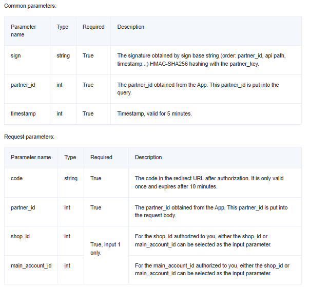

## API Endpoints

### 1. Get All Products

**Endpoint:** `http://192.168.0.73:5000/api/products`

**Method:** `GET`

Fetches all products in the database.

Example Response:

```json
[
  {
    "id": 1,
    "name": "Smartphone",
    "description": "Latest model smartphone with advanced features",
    "platform": "Shopee",
    "stock": 100,
    "sku": "SM12345",
    "currency": "USD",
    "price": 799.99,
    "status": "available",
    "created_at": "2025-01-23 10:00:00",
    "updated_at": "2025-01-23 10:00:00"
  },
  ...
]
```

### 2. Get Product by ID

**Endpoint:** `http://192.168.0.73:5000/api/products/<product_id>`

**Method:** `GET`

Fetches a single product by ID.

Example Response:

```json
{
  "id": 1,
  "name": "Smartphone",
  "description": "Latest model smartphone with advanced features",
  "platform": "Shopee",
  "stock": 100,
  "sku": "SM12345",
  "currency": "USD",
  "price": 799.99,
  "status": "available",
  "created_at": "2025-01-23 10:00:00",
  "updated_at": "2025-01-23 10:00:00"
}
```

### 3. Shopee Authentication

**Endpoint:** `http://192.168.0.73:5000/api/shopee_auth`

**Method:** `POST`

Authenticate with Shopee using either the **shop ID** or **main account ID** along with the necessary parameters.



#### Option 1: Authenticate using `shop_id`

To authenticate using the **shop ID**, provide the `shop_id` in the request body along with the required parameters like `sign`, `partner_id`, `timestamp`, and `code`.

Example Request Body:

```json
{
  "sign": "signature_example",
  "partner_id": "partner_123",
  "timestamp": 1674518400,
  "code": "auth_code_example",
  "shop_id": "shop_1"
}
```

#### Option 2: Authenticate using `main_account_id`

Alternatively, authenticate using the **main account ID** by providing `main_account_id` in the request body along with the necessary parameters.

Example Request Body:

```json
{
  "id": "1",
  "request_id": "12345",
  "error": "none",
  "refresh_token": "refresh_token_abc123",
  "access_token": "access_token_xyz789",
  "expire_in": "3600",
  "message": "Success",
  "merchant_id_list": ["merchant_1", "merchant_2"],
  "shop_id_list": ["shop_1", "shop_2"]
}
```
